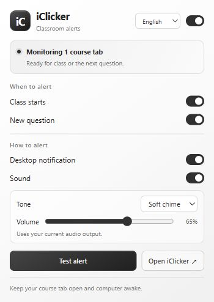

# iClicker Notifier

[English](README.md) · [简体中文](README.zh-CN.md)

A small Chrome extension that alerts you when an iClicker class starts or a new question opens. English and Chinese, with a quiet black, white, and gray interface.



## Features

- Separate alerts for class starts and new questions.
- Desktop notifications and sound, each with its own switch.
- Three built-in tones, adjustable volume, and a test button.
- Automatic language selection, or choose English / 简体中文.
- Local processing, no account setup, no analytics, and no external dependencies.

## Install

Requires **Chrome 116 or newer**. No build step is needed.

1. On this repository, choose **Code → Download ZIP**, then extract it.
2. Open `chrome://extensions` and turn on **Developer mode**.
3. Click **Load unpacked** and select the extracted **`extension`** folder, which contains `manifest.json`.
4. Pin the extension if you like, then **refresh any open iClicker tabs**.
5. Open the extension and test your selected notification channels.

Keep the extracted folder: Chrome loads the extension from that location. After updating its files, click **Reload** on the extension card and refresh iClicker again.

## Use

1. Sign in at [iClicker Student](https://student.iclicker.com/) and open the course you want to monitor. **Leave that course's overview page open while waiting for class.** You can keep different courses in separate tabs.
2. When class starts, manually click **Join Class**. Leave the classroom page open to receive question alerts.
3. Open the extension to select events, notification channels, tone, volume, and language. Settings save automatically; the main switch pauses automatic alerts.

Click a desktop notification to return to iClicker. Sound uses your computer's current audio output, so select speakers in your operating system if you are using headphones.

The extension reads visible page state. It does not join classes, submit answers, or unlock content hidden by an instructor.

## Reliability

Keep Chrome, the course tab, and your computer running. Sleep, an expired login, offline periods, discarded tabs, or changes to the iClicker website can delay or prevent alerts. In Chrome's **Settings → Performance**, add `student.iclicker.com` to **Always keep these sites active** if Memory Saver suspends the tab.

If the extension shows no connection, refresh the course tab. For missing desktop notifications, check Chrome and system notification settings and Do Not Disturb. For missing sound, check the extension volume and your system audio output.

Automated tests and browser fixtures cover simulated behavior. **Live classroom delivery and operating-system notifications still need verification on your own setup.** Try the test button before relying on alerts in class.

## Privacy and permissions

The extension only runs on `https://student.iclicker.com/*`. It uses `storage` for local preferences and temporary runtime state, `notifications` for desktop alerts, and `offscreen` to play locally generated sounds. It sends no data to an extension server and includes no analytics or remote scripts. See the [privacy policy](docs/PRIVACY.md).

## Development

Use Node.js 22 to run the dependency-free tests:

```sh
node --test tests/*.test.cjs
```

To run DOM integration fixtures and preview the settings panel:

```sh
node tests/dev-server.cjs
```

Open `http://127.0.0.1:8765/tests/browser.html` for checks or `http://127.0.0.1:8765/extension/popup.html` for a simulated panel. The preview uses mocked Chrome APIs; it does not test actual extension permissions or notification delivery.

Bug reports and contributions are welcome. Use synthetic examples and remove student details, course identifiers, and credentials from reports or screenshots.

## License

[MIT](LICENSE). This is an independent community project, not affiliated with or endorsed by iClicker or Macmillan Learning. Product names belong to their respective owners.
