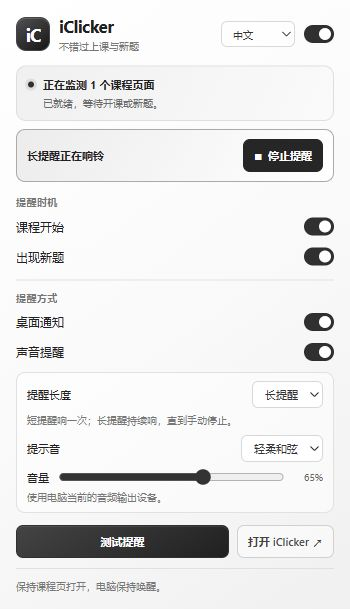

# iClicker Notifier · 课堂提醒

[English](README.md) · [简体中文](README.zh-CN.md)

一个轻量 Chrome 扩展，在 iClicker 开课或老师开放新题时提醒你。支持中英文，采用简洁的黑白灰界面。



## 功能

- 开课提醒、新题提醒可分别开关。
- 桌面通知、声音提醒可独立选择。
- 三种内置音效、音量调节、测试按钮。
- 短提醒响一次；长提醒持续循环，直到手动停止。
- 语言自动跟随浏览器，也可手动选择 English / 简体中文。
- 本地处理，无需额外账户，无统计追踪，无外部依赖。

## 安装

需要 **Chrome 116 或更新版本**，无需编译。

1. 在本仓库页面点击 **Code → Download ZIP**，下载并解压。
2. 在 Chrome 地址栏输入 `chrome://extensions`，开启**开发者模式**。
3. 点击**加载已解压的扩展程序**，选择解压后的 **`extension`** 文件夹，也就是包含 `manifest.json` 的文件夹。
4. 可以将扩展固定到工具栏，然后**刷新已经打开的 iClicker 页面**。
5. 打开扩展面板，测试你选中的通知方式。

请保留解压后的文件夹，Chrome 会从这里加载扩展。更新文件后，需要在扩展管理页点击**重新加载**，再刷新 iClicker。

## 使用

1. 登录 [iClicker 学生网页版](https://student.iclicker.com/)，进入需要监听的课程。**等待开课时，保持该课程的概览页面打开。** 不同课程可以分别开标签页。
2. 收到开课提醒后，手动点击 **Join Class** 进入课堂；保持课堂页打开，才能接收新题提醒。
3. 打开扩展，选择提醒事件、通知方式、提醒模式、音效、音量和语言。设置自动保存；总开关可以暂停自动提醒。

默认使用**短提醒**，所选音效只播放一次。**长提醒**会一直循环播放，直到点击扩展面板或桌面通知中的**停止提醒**。关闭扩展面板后仍会继续响，重新打开面板即可停止。点击桌面通知正文也会停止声音并打开 iClicker；仅关闭桌面通知不会停止声音。

提醒模式只影响声音，每次事件仍只弹出一次桌面通知。关闭总开关、关闭声音、将音量设为零或切换提醒模式，也会停止当前声音。测试按钮同样遵循所选模式，长提醒测试需要手动停止。更新扩展会保留原有设置，未选择过提醒模式时默认使用短提醒。

点击桌面通知可以返回 iClicker。声音从**系统当前音频输出设备**播放；如果正在用耳机，但希望扬声器发声，请在系统设置中切换音频输出。

扩展根据可见页面状态判断提醒，不会自动加入课堂、提交答案或解锁老师隐藏的内容。

## 提醒可靠性

请保持 Chrome、课程标签页和电脑运行。电脑睡眠、登录过期、断网、标签页休眠或 iClicker 页面改版，都可能让提醒延迟或失效。如果内存节省模式导致标签页休眠，可在 Chrome 的**设置 → 性能**中，将 `student.iclicker.com` 加入**始终保持这些网站处于活动状态**。

显示未连接时，刷新课程页面。桌面通知不出现时，检查 Chrome 和系统的通知权限、勿扰模式；没有声音时，检查扩展音量、系统音量和音频输出设备。

自动化测试和浏览器测试页面覆盖的是模拟场景。**真实课堂和操作系统通知的完整提醒效果，仍需在你的设备上验证。** 首次使用前，请先点击测试按钮。

## 隐私与权限

扩展只在 `https://student.iclicker.com/*` 运行。`storage` 用于本地设置和临时运行状态，`notifications` 用于桌面通知，`offscreen` 用于播放本地合成的提示音。不向扩展服务器发送数据，不包含统计追踪或远程脚本。详情见[隐私说明](docs/PRIVACY.md#简体中文)。

## 开发

使用 Node.js 22 运行测试，无需安装依赖：

```sh
node --test tests/*.test.cjs
```

运行页面状态测试和设置面板预览：

```sh
node tests/dev-server.cjs
```

打开 `http://127.0.0.1:8765/tests/browser.html` 查看测试，或打开 `http://127.0.0.1:8765/extension/popup.html` 查看模拟面板。预览使用模拟 Chrome API，不能验证真实扩展权限或通知投递。

打开 `http://127.0.0.1:8765/tests/audio-browser.html`，点击 **Run audio checks**，可使用浏览器的真实 Web Audio 引擎检查短提醒、长提醒循环和停止。测试会播放几次低音量提示音；扩展消息通道仍是模拟的。

欢迎提交问题和改进。报告问题时请使用虚构示例，并移除截图或日志中的学生信息、课程标识和登录凭据。

## 许可证

[MIT](LICENSE)。本项目由社区独立开发，与 iClicker 或 Macmillan Learning 无隶属关系，也未经其背书。产品名称属于各自的权利人。
